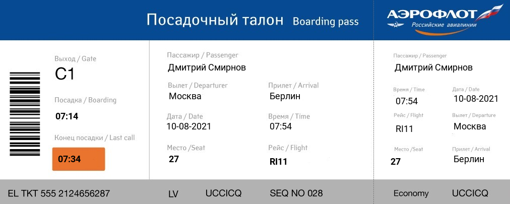

# Chat bot for booking flights

This bot is an automated flight booking system. It is designed to facilitate the process of searching and booking air tickets for passengers. **In reality, the bot does not book tickets and is just an interactive model**. At the moment, the bot supports only Russian.

## Status: Completed

## Opportunities

- **Search for flights**: The bot can search for flights using various parameters, such as the place of departure, destination, date and time of departure, number of passengers.
- **Flight Information Display**: After performing the search, the bot will provide information about available flights, including details about departure time, arrival time, airline.
- **Booking tickets**: The user can select a specific flight, and then the bot will book tickets and provide confirmation of the reservation.

## Features
1. **Booking takes place using a scenario system** in which the user gradually selects the flight parameters he needs.
2. **The search for the names of cities in the user's message occurs using regular expressions**: this allows the user to write the name in any existing form.
3. **The flight database is generated by a built-in algorithm**: It is configured in such a way that it generates flights between the 100 largest cities in Europe. The algorithm generates both periodic flights and random ones. In total, 2 flights are generated between 2 cities every week, 2 flights every month and 5 random ones.
4. **Ticket generation**: The bot creates a ticket image based on the data entered by the user. Ticket example

## Installation
1. Clone repository: git clone https://github.com/emphat1cBaby/booking-flights-vk-bot.git
2. Go to the project directory: cd booking-flights-vk-bot
3. Install dependencies: pip install -r requirement.txt
4. Create a VK community, enable the ability to connect a bot and generate a key
5. Create your own config.py file from config.py.default
6. Deploy bot on server

## Usage

In order to start using the bot, just text him "привет" or "информация". At the moment, the bot supports only Russian.

## Authors

Dmitriy Smirnov - https://t.me/emphaticBaby

## Stack

- *Library pony orm* - simple, fast and intuitive object-relational system for working with databases in Python.
- *Library vk_api* -  for working with the VKontakte API in Python. It provides convenient and easy-to-use tools for interacting with the VK API, allowing developers to create applications, bots and scripts to automate tasks on the VKontakte social network.
- *Library PILL* - is a popular library for working with images in Python. It provides many functions and methods for opening, changing, saving and processing images of various formats.
